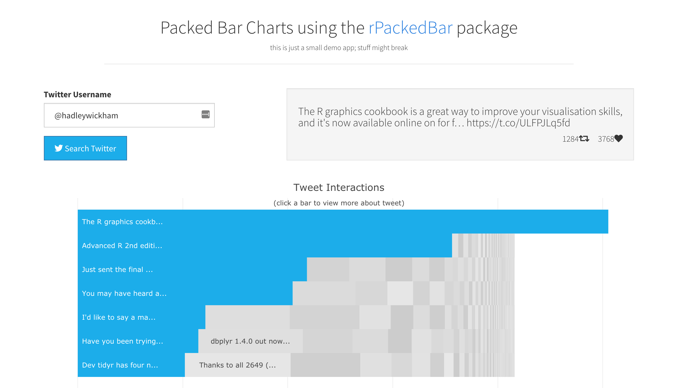

# rPackedBarDemo
New home for [rPackedBar demo shiny app](https://spannbaueradam.shinyapps.io/rPackedBarDemo/).

The demo app is an example of using [rPackedBar](https://cran.r-project.org/package=rPackedBar) to dynamically visualize Twitter data.

 <a href="https://spannbaueradam.shinyapps.io/rPackedBarDemo/" target="_blank">
 <kbd>
  
 </kbd>
 </a>

